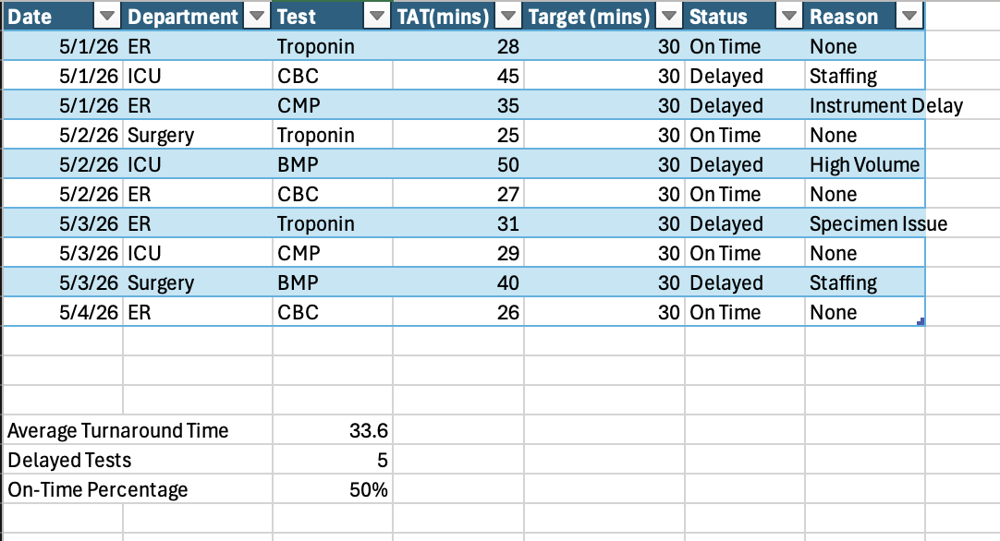
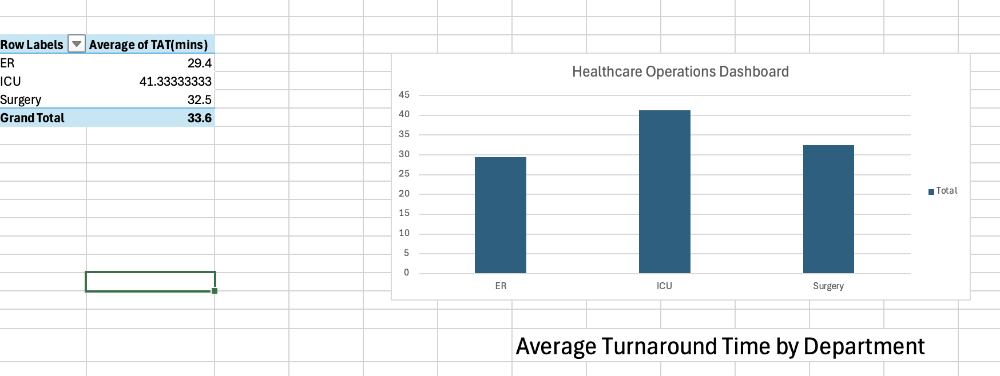

# Healthcare Operations Dashboard

## Project Overview
Developed an Excel-based healthcare operations dashboard to analyze turnaround times, reporting delays, and workflow efficiency across hospital departments.

## Tools Used
- Microsoft Excel
- Pivot Tables
- KPI Reporting
- Data Visualization

## Key Metrics
- Average turnaround time: 33.6 minutes
- On-time completion rate: 50%
- Identified workflow delays related to staffing, specimen issues, and high testing volume

## Project Objectives
- Track operational performance metrics
- Analyze turnaround time trends
- Identify workflow bottlenecks
- Support process improvement initiatives

## Dashboard Preview

### Operations Data

### Pivot Table & Visualization

## Skills Demonstrated
- Workflow Analysis
- Operational Reporting
- KPI Tracking
- Data Analysis
- Process Improvement
- Healthcare Operations
- Excel Reporting
